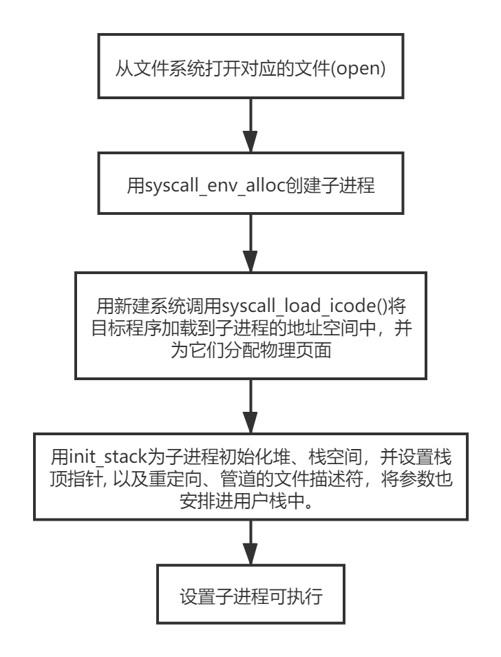

# OS Lab-6 Report

## 一、实验思考题

### Thinking 6.1

*示例代码中，父进程操作管道的写端，子进程操作管道的读端。如果现在想让父进程作为“读者”，代码应当如何修改？*

将`switch`中`case 0:`和`default:`部分的语句块互换

***

### Thinking 6.2

*上面这种不同步修改 pp_ref 而导致的进程竞争问题在 user/fd.c 中的dup 函数中也存在。请结合代码模仿上述情景，分析一下我们的 dup 函数中为什么会出现预想之外的情况？*

假设父子进程，有一对管道`p[2]`，其中父进程关闭`p[0]`完毕，准备测试`ispipeclosed(p[1])`。子进程`dup(p[1])`刚dup完毕fd，还没开始dup Pipe结构体。

此时`p[1]`引用数为3，`p[0]`引用数为1，Pipe结构体所在页因为被map到父进程的`p[0]`和子进程的`p[0]`、`p[1]`的fdData处，引用数也为3，此时pageref(wfd) = pageref(pipe)父进程的`ispipeclosed(p[1])`就会被误判为true。

***

### Thinking 6.3

*阅读上述材料并思考：为什么系统调用一定是原子操作呢？如果你觉得不是所有的系统调用都是原子操作，请给出反例。希望能结合相关代码进行分析。*

所有的系统调用都是原子操作。用户进程执行syscall后到操作系统完成操作返回的过程中，不会有其他程序执行。系统调用开始时，操作系统就会关闭中断（syscall.S中的CLI指令）。因此系统调用不会被打断。对于sys_ipc_recv，应理解为设置进程进入recv状态，这个设置过程不会被打断，因而也是原子操作。

***

### Thinking 6.4

*仔细阅读上面这段话，并思考下列问题*

- *按照上述说法控制 pipeclose 中 fd 和 pipe unmap 的顺序，是否可以解决上述场景的进程竞争问题？给出你的分析过程。*

- *我们只分析了 close 时的情形，那么对于 dup 中出现的情况又该如何解决？请模仿上述材料写写你的理解。*

可以，因为原情况出现的原因是：a, b二值, a > b当先减少a再减少b时，就可能会出现a == b的中间态。改变顺序后b先减少 a > b > b\* 不会出现这种状态。

dup是类似的，只不过情况变成了先增加b再增加a，改变顺序之后先增加a再增加b，也就不会有这种情况发生。

***

### Thinking 6.5

*bss 在 ELF 中并不占空间，但 ELF 加载进内存后，bss 段的数据占据了空间，并且初始值都是 0。请回答你设计的函数是如何实现上面这点的？*

Load二进制文件时，根据bss段数据的memsz属性分配对应的内存空间并清零。

***

### Thinking 6.6

*为什么我们的 *.b 的 text 段偏移值都是一样的，为固定值？*

user.lds中有如下内容，规定了.text段在链接中第一个被链接，因此开始位置相同。

```c
  . = 0x00400000;

  _text = .;    /* Text and read-only data */
  .text : {
	*(.text)
	*(.fixup)
	*(.gnu.warning)
	}
```

***

### Thinking 6.7

*在哪步，0 和 1 被” 安排” 为标准输入和标准输出？请分析代码执行流程，给出答案。*

user/init.c中。

```c
    if ((r = opencons()) < 0)
		user_panic("opencons: %e", r);
	if (r != 0)
		user_panic("first opencons used fd %d", r);
	if ((r = dup(0, 1)) < 0)
		user_panic("dup: %d", r);
```

## 二、实验难点图示

- spawn过程



这次我的spawn采用系统调用来加载程序，有效复用了Lab-3的代码.

## 三、体会与感想

本次实验难度一般，难点在于pipe在多进程并发环境下可能出现的一些问题和spawn函数的设计，其中后者我利用系统调用巧妙地避开了。

实验内容方面，真正测试shell才发现我们的小系统还是有太多这样那样的不完善之处，但是这样能让一个小系统跑起来，也是一个很大的收获。

## 四、【可选】指导书反馈

lab6-extra的测试真的是，绝了。大多数测试点的不过都是因为调度或者fork导致的时序问题，在PV操作的语义上都是正确的。这点我觉得不太合适。测试程序应当利用信号量（Barrier）以及check_val函数将多进程并发的不确定性缩小在很少的几条语句上，然后再进行大量循环来尽可能使另一个程序先执行。而事实上fork的时间长短都会影响测试的结果，说明测试只是用一定的循环（循环量还不是很大）来得到一个“大概率（并不大，看看多少11/13）正确”的东西，这样对实验很不友好。（交了30多次最后发现是时间跟评测机对不上啊喂）